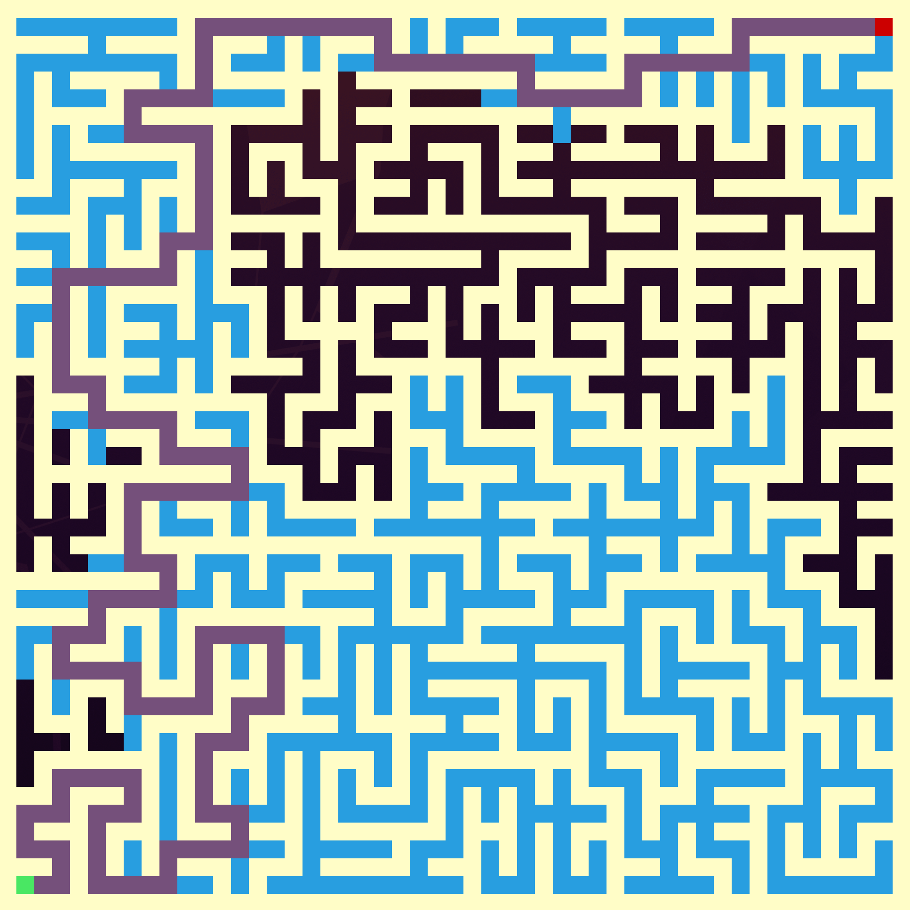

# Maze Generator and Path Finder

## Maze Generation Algorithms

- Randomized Depth-First-Search
- Randomized Kruskal's
- Randomized Prim's
- Aldous-Broder

## Path Finding Algorithms

- A*

## Output Configuration

- Colors are supported on Xterm, Alacritty, Terminator, and potentially other feature-rich terminals with extensive color support. 
- Mazes can be saved as either binary or as they are displayed. The binary version is twice as compact and is compatible with all other terminals and file systems while the displayed mazes may not work on systems without extended ASCII support.
- Paths can be saved in only a numeric format for consistency. They can be easily reloaded and displayed.
- Paths can be configured to track visited cells or to ignore them.